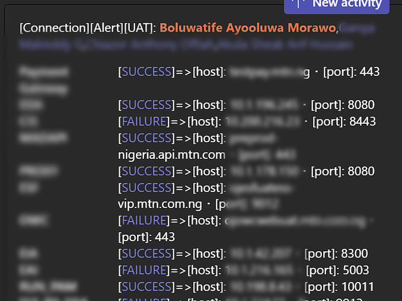

# Interesting Jobs

Interesting Job(s) is/will be a collection of simple/medium bash scripts that may prove useful to deploy within a windows/linux environment or a docker/kubernetes cluster.

Each major subfolder with have it's `HOW-TO.md` instruction 

## EXAMPLE - connectivity-monitor-msteams
eg. [connectivity-monitor-msteams](monitoring\connectivity-monitor-msteams) is a job that can monitor connectivity to hosts (preferably external) and alert your team on teams 😄 when one or more of the monitored hosts does not respond favourably to the connectivity test. It will also emit logs that can be captured on tools like prometheus,Elastic etc...

- ### kubernetes
    - Setup kubernetes. You can do so easily and quickly with [Play with kuberntes](https://labs.play-with-k8s.com/).
    - Create a Team and channel on Microsoft teams. Then [Create an Incoming Webhook](https://learn.microsoft.com/en-us/microsoftteams/platform/webhooks-and-connectors/how-to/add-incoming-webhook?tabs=dotnet) and get the webhook's link.
    - Download the manifests' template from this [link](https://raw.githubusercontent.com/hayone1/InterestingJobs/main/monitoring/connectivity-monitor-msteams/template-kubernetes.yaml).
    - edit the `ConfigMap` and apply the file to the cluster.
    > using curl, yq and kubectl, here is an example.
    ```
    manifest=$(curl https://raw.githubusercontent.com/hayone1/InterestingJobs/main/monitoring/connectivity-monitor-msteams/template-kubernetes.yaml)
    ```

    ```
    export notification_hosts='[
        {
            "name" : "Google",
            "host" : "https://google.com",
            "port" : "443"
        },
        {
            "name" : "Facebook",
            "host" : "https://facebook.com",
            "port" : "443"
        }
    ]'
    export notification_team='[
        {
            "type": "mention",
            "text": "<at>John</at>",
            "mentioned": {
                "id": "John.Doe@outlook.com",
                "name": "John Doe D"
            }
        },
        {
            "type": "mention",
            "text": "<at>Foo</at>",
            "mentioned": {
                "id": "foo.bar@foobar.com",
                "name": "Foo Bar Baz"
            }
        }
    ]'
    ```

    ```
    echo "$manifest" | yq '. |
    (select(.kind == "Deployment").metadata.namespace) |= "dafault" |
    (select(.kind == "ConfigMap").metadata.namespace) |= "dafault" |
    (select(.kind == "ConfigMap").data.HOSTS) |= strenv(notification_hosts) |
    (select(.kind == "ConfigMap").data.TEAM) |= strenv(notification_team) | 
    (select(.kind == "ConfigMap").data.WEBHOOK_URL) |= "https://lorem-ipsum.teamswebhook.com/test-webhook" |
    (select(.kind == "ConfigMap").data.SCRIPT_URL) |= "https://raw.githubusercontent.com/hayone1/InterestingJobs/main/monitoring/connectivity-monitor-msteams/check-connectivity-msteams.sh"' | 
    tee connectivity-manifest.yaml
    ```
    ```
    kubectl apply --kubeconfig "kubeconfig.yaml" -f connectivity-manifest.
    ```
    ```
    kubectl logs deployment/connectivity-test -n dafault --kubeconfig "kubeconfig.yaml"
    ```
    If there is an alert, you'll see it in the teams channel and the job will back-off before trying the reach the hosts again.
    
    

## Repo Summary
<pre>
├───images
└───monitoring
    ├───connectivity-monitor-msteams
    ├───images
    └───scripts
</pre>

## Contributions
Contributing that simple stript that took your hours to figure out but saved you lots of future headache would really go a long way to helping others who find it.

So open a pull request and contribute to open source ✨.